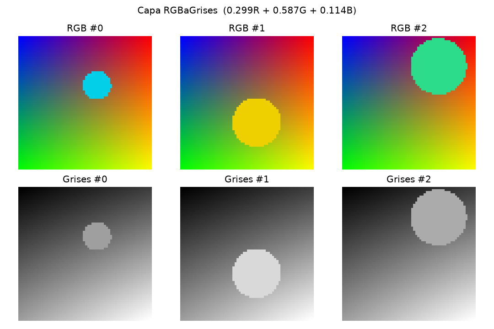
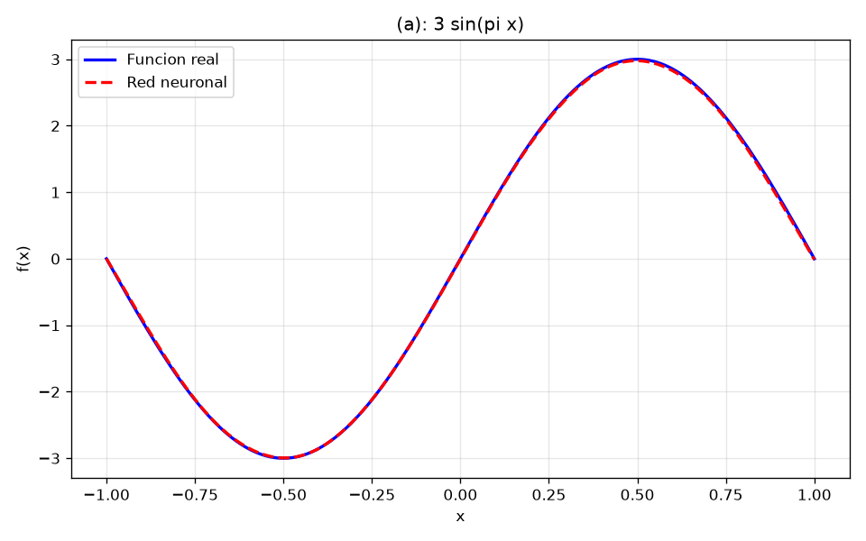
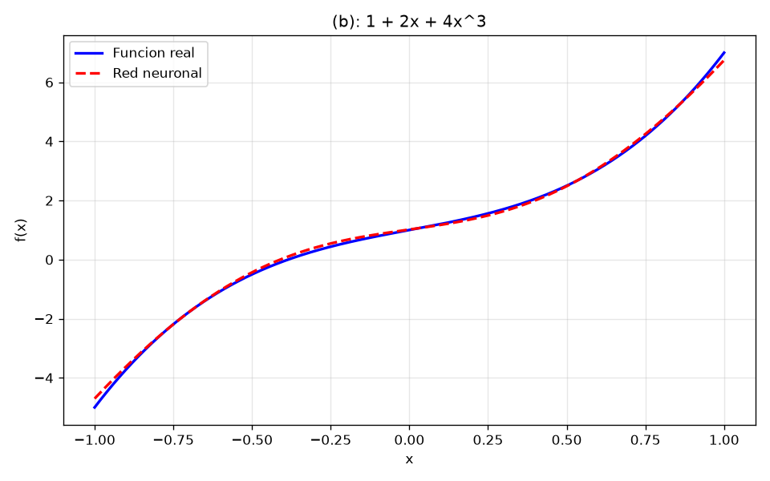
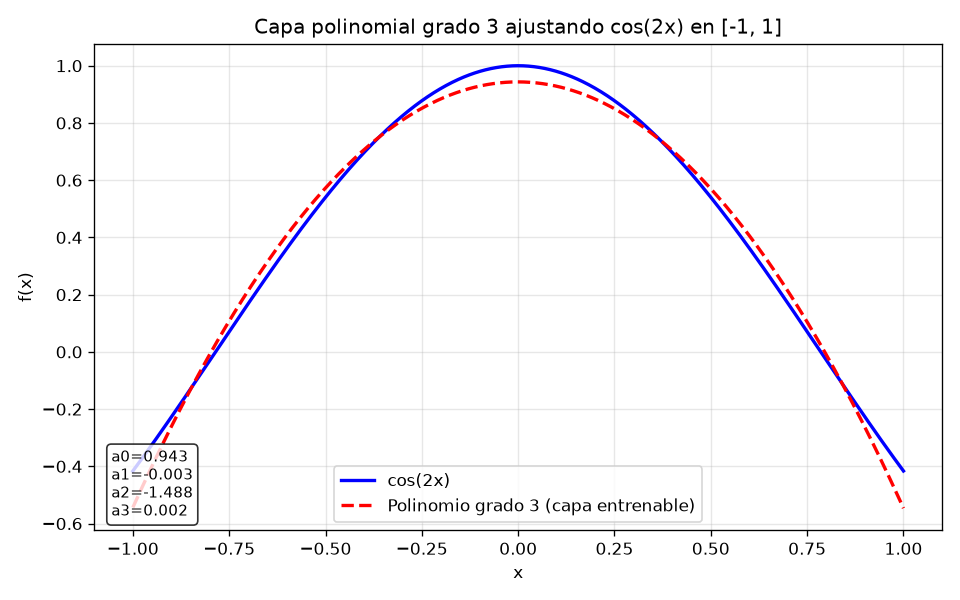
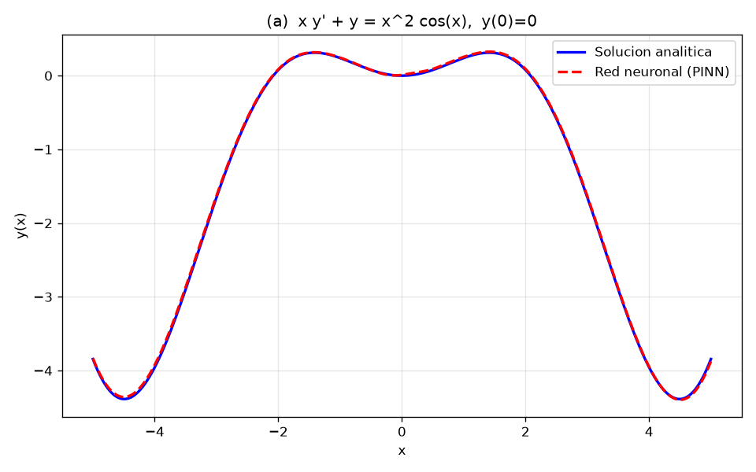
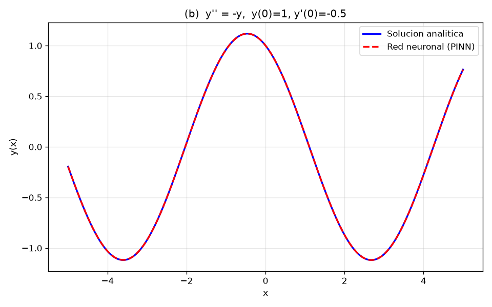

# Tarea 3: Funciones, Modelos personalizados y Ecuaciones Diferenciales

Reporte de resultados. Todo el código está en scripts `.py` ejecutables con
TensorFlow/Keras 2.21. Cada script guarda sus gráficas en `figuras/`.

## Cómo ejecutar

```bash
python p1_capa_rgb_a_grises.py
python p2_aproximacion_funciones.py
python p3_capa_polinomial.py
python p4_edo_pinn.py
```

---

## Problema 1 — Capa RGB → escala de grises

**Archivo:** `p1_capa_rgb_a_grises.py`

Se diseña la capa `RGBaGrises`, subclase de `tf.keras.layers.Layer`, sin
parámetros entrenables. Aplica la conversión de luminosidad ITU-R BT.601:

```
gris = 0.299 R + 0.587 G + 0.114 B
```

La capa recibe un tensor `(..., 3)` y devuelve `(..., 1)` mediante un producto
matricial con un vector constante de pesos `(3, 1)`. Se prueba sobre imágenes
RGB sintéticas (gradientes + círculos de color), sin necesidad de descargar
datos.

**Resultado:** la salida coincide exactamente con la fórmula directa
(error máximo = `0.00e+00`). El modelo tiene 0 parámetros, como se espera de
una capa sin entrenamiento.



---

## Problema 2 — Aproximación de funciones en [-1, 1]

**Archivo:** `p2_aproximacion_funciones.py`

Red usada para cada función: MLP `1 → 64 → 64 → 1` con activación `tanh`,
optimizador Adam (`1e-3`), MSE, 2000 épocas.

| Inciso | Función        | MSE final |
|--------|----------------|-----------|
| (a)    | `3 sin(pi x)`  | 1.48e-04  |
| (b)    | `1 + 2x + 4x³` | 6.64e-03  |

La red reproduce ambas funciones con alta fidelidad; las curvas roja (red) y
azul (función real) prácticamente se superponen.




---

## Problema 3 — Capa entrenable polinomial (grado 3)

**Archivo:** `p3_capa_polinomial.py`

Se diseña la capa `CapaPolinomio3` con 4 pesos entrenables `[a0, a1, a2, a3]`
que evalúa `f(x) = a0 + a1 x + a2 x² + a3 x³`. Se entrena para ajustar
`cos(2x)` en `[-1, 1]` (Adam `5e-2`, MSE, 3000 épocas).

**Coeficientes aprendidos:**

| a0     | a1      | a2      | a3     |
|--------|---------|---------|--------|
| 0.9435 | -0.0033 | -1.4884 | 0.0020 |

- MSE final: **2.04e-03**.
- Los coeficientes impares (`a1`, `a3`) quedan ~0, coherente con que `cos(2x)`
  es una función **par**.
- `a0 ≈ 0.94` y `a2 ≈ -1.49` corresponden al mejor ajuste por mínimos
  cuadrados del polinomio de grado 3 sobre todo el intervalo (no idéntico a la
  serie de Taylor `1 - 2x²`, que solo es exacta cerca de x=0).



---

## Problema 4 — Ecuaciones diferenciales (PINN) en [-5, 5]

**Archivo:** `p4_edo_pinn.py`

Se entrena una red neuronal como *Physics-Informed Neural Network*: se minimiza
el residuo de la EDO en puntos de colocación más las condiciones iniciales.
Las derivadas se calculan por diferenciación automática (`tf.GradientTape`).
Red: `1 → 64 → 64 → 64 → 1`, `tanh`, Adam `1e-3`, 8000 épocas.

### (a) `x y' + y = x² cos(x)`, `y(0) = 0`

Como `x y' + y = (x y)'`, integrando se obtiene la solución analítica:

```
y(x) = x sin(x) + 2 cos(x) - 2 sin(x)/x       (con y(0)=0 en el límite)
```

- **RMSE red vs analítica: 1.79e-02.**
- La red reproduce fielmente la solución en todo `[-5, 5]`.



### (b) `y'' = -y`, `y(0) = 1`, `y'(0) = -0.5`

Solución analítica:

```
y(x) = cos(x) - 0.5 sin(x)
```

Se imponen las dos condiciones iniciales (valor y derivada en x=0) usando una
`GradientTape` anidada para `y'(0)`.

- **RMSE red vs analítica: 6.36e-04.**



---

## Resumen

| Problema | Métrica | Valor |
|----------|---------|-------|
| P1 capa RGB→grises | error vs fórmula | 0.00 |
| P2a `3 sin(pi x)` | MSE | 1.48e-04 |
| P2b `1+2x+4x³` | MSE | 6.64e-03 |
| P3 capa polinomial | MSE | 2.04e-03 |
| P4a EDO 1er orden | RMSE | 1.79e-02 |
| P4b EDO 2do orden | RMSE | 6.36e-04 |
